# Desenvolvimento Dinâmico - Atividade 4

Neste projeto acadêmico foi utilizado o JavaScript para o estudo dos diversos conceitos da linguagem.

O objetivo deste projeto é criar uma página simples e manipular os elementos do DOM através do JavaScript, implementando o cadastro de funcionários, que pode ser um desenvolvedor ou um gerente.

O projeto foi desenvolvido utilizando HTML, CSS e JavaScript, sem a utilização de banco de dados.

## Tópicos Abordados

Este projeto aplica conhecimentos teóricos estudados durante as aulas, em práticas, sendo eles:

- **Conceitos Básicos**: Preparação do ambiente, estrutura e sintaxe do JavaScript.
- **Lógica de Programação** 
- **Instruções Condicionais**
- **Instruções de Repetição**
- **Manipulação de Coleção de Dados**
- **Classes e Funções**
- **Manipulação de Elementos do DOM**
- **Exceptions**
- **Promises**
- **Formato JSON**

## Funcionalidades

O sistema desenvolvido permite:

- **Cadastro de Funcionários**: Adicione funcionários ao sistema, especificando se são desenvolvedores (e linguagem de programação) ou gerentes (e departamento).
- **Visualização de Funcionários**: Visualize o funcionário cadastrado em tabela de funcionários.
- **Manipulação de Dados**: Remova ou interaja com funcionários conforme necessário.

## Funcionamento
### Adicionar Funcionário
Preencha o formulário com as informações do funcionário e clique no botão "Adicionar".

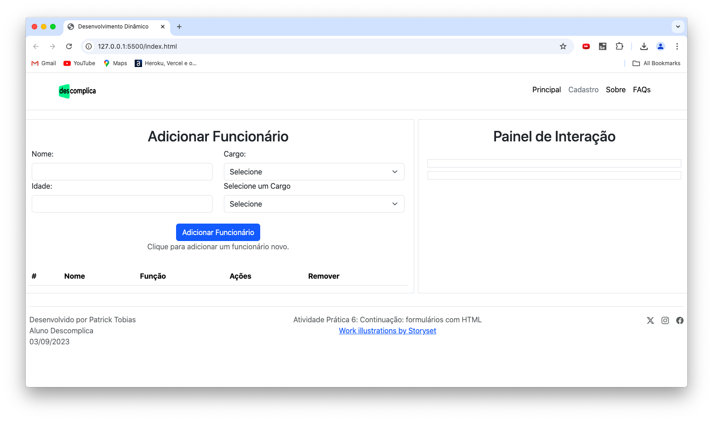
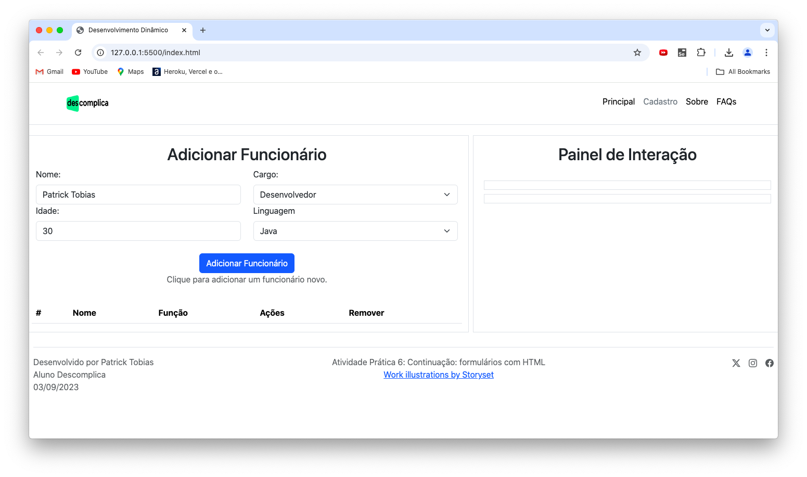
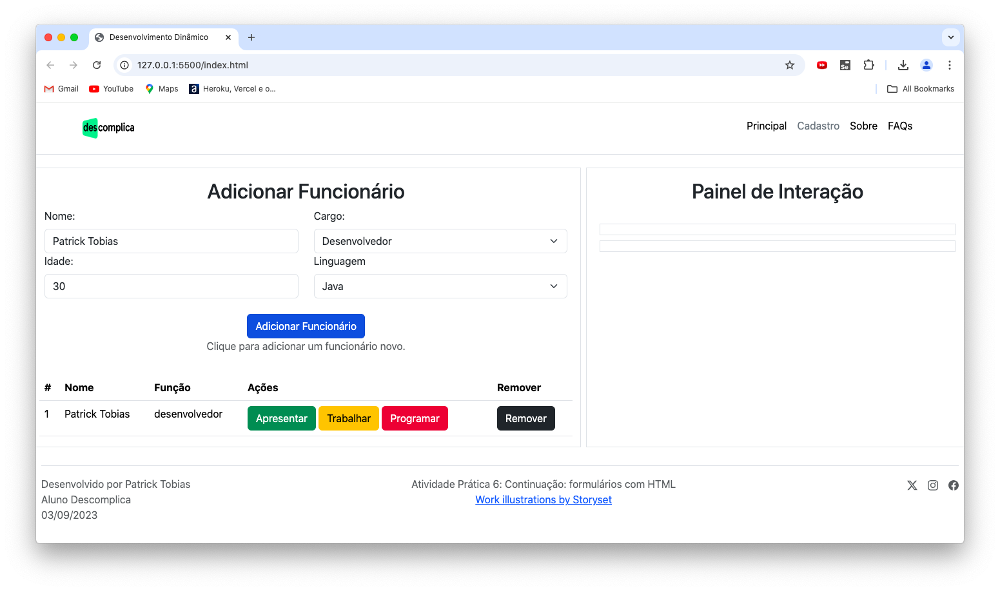

### Interagir com Funcionário
Clique nos botões de ação para interagir com funcionários.

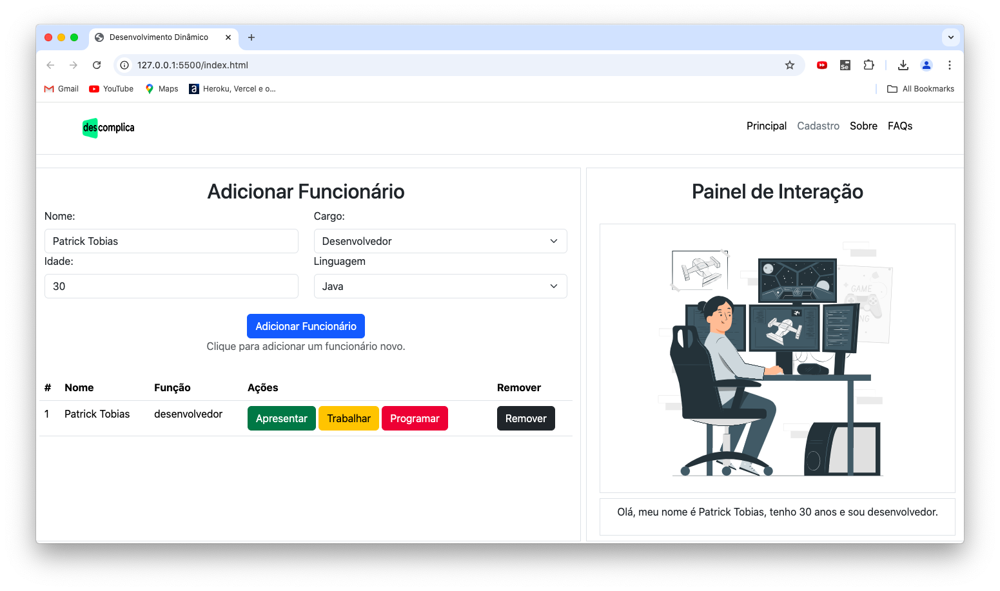
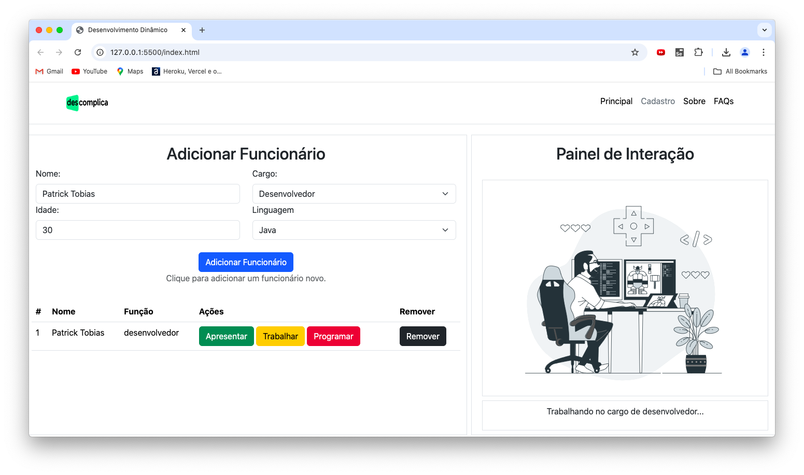

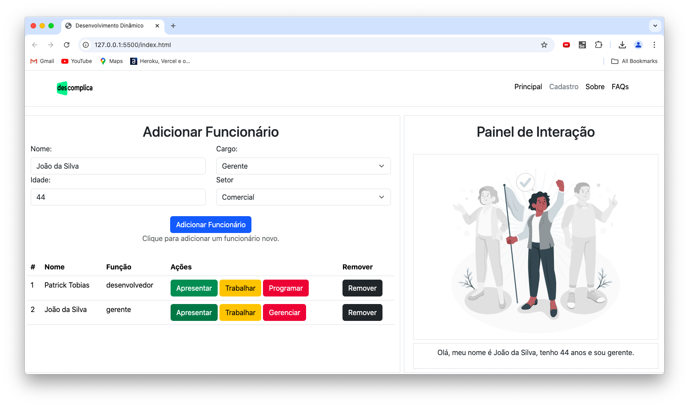
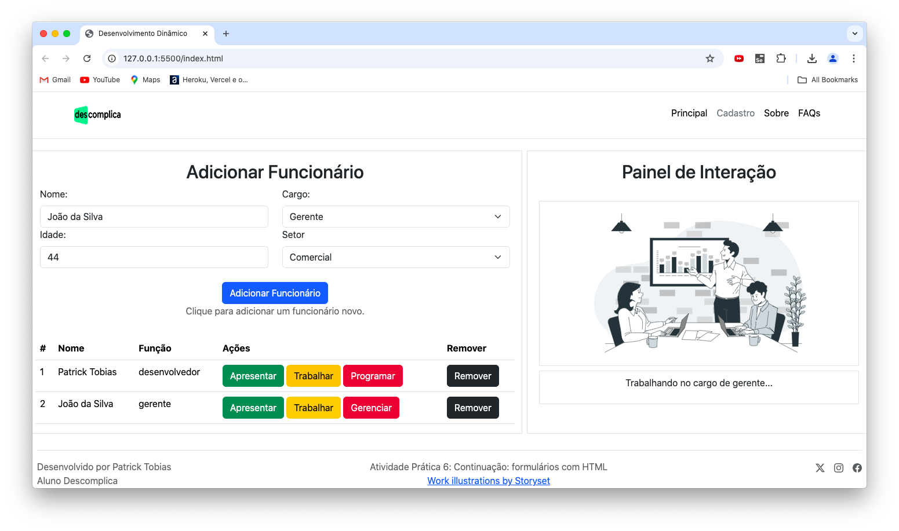
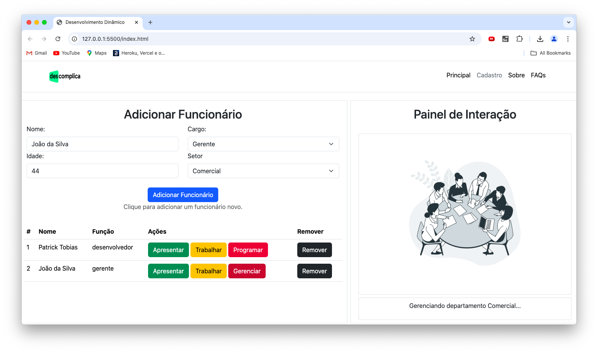

### Remover Funcionários
Clique no botão remover para remover um funcionário da tabela.

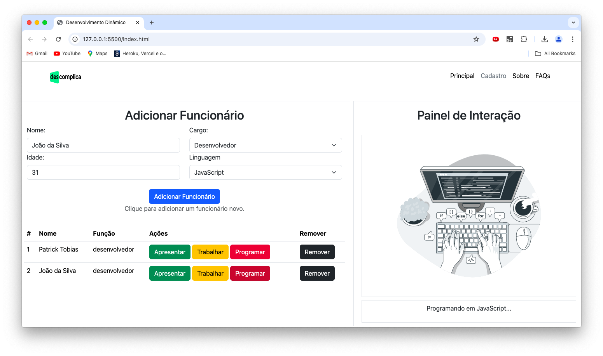
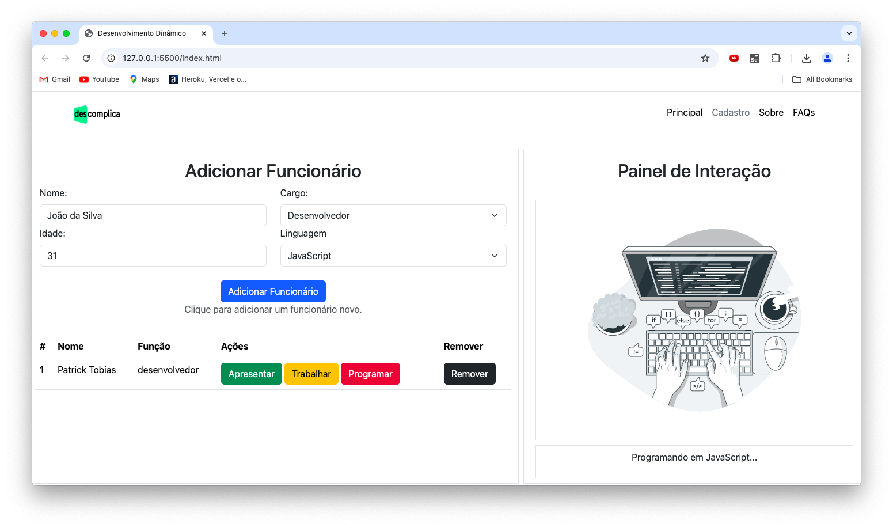

### Exceções
Conheça as exceções da aplicação

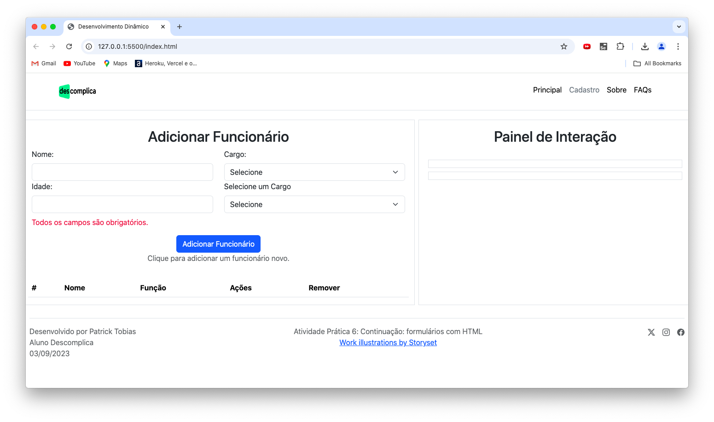
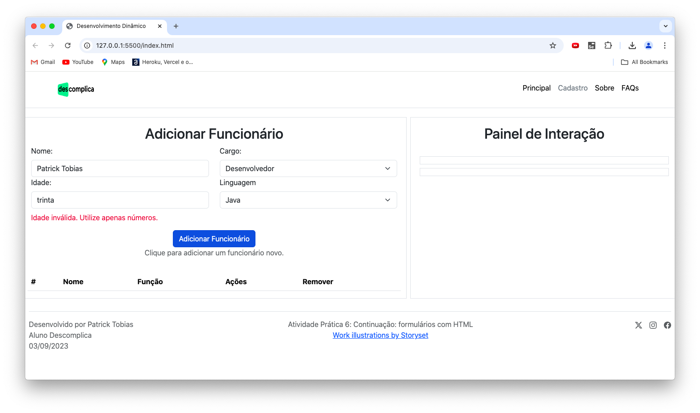